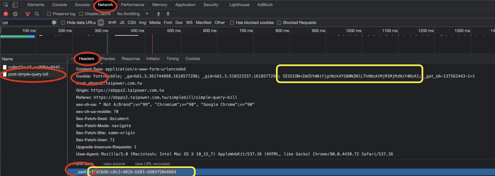

Home assistant for 台電電費

此方法是由強者 [Jason Lee](https://www.dcard.tw/@jas0n.1ee.com) 所提供.

使用本整合, 必須由你承擔任何風險.

## 安裝

你可以使用 [HACS](https://hacs.xyz/) 來安裝此整合元件. 步驟如下 custom repo: HACS > Integrations > 3 dots (upper top corner) > Custom repositories > URL: `tsunglung/TaiPowerFee` > Category: Integration

或是手動複製 `taipower_fee` 到你的設定資料夾 (like /config) 下的 `custom_components` 目錄.

然後重新啟動 HA.

# 安裝

你必須取得 cookie 和 csrf 令牌.

**1. 取得步驟**

1. 開啟開發者工具 (使用 Google chrome/Microsoft Edge) [Crtl+Shift+I / F12]
2. 打開 Network 頁面
3. 打開 [TaiPower Fee Web site](https://ebpps2.taipower.com.tw/simplebill/simple-query-bill) 網站, 輸入電號和驗證碼.
4. 在 filter 欄位, 搜尋 "post-simple-query-bill" (會有二個項目)
5. 移動到 "headers" -> "request headers"
6. 複製在 Cookie 欄位下, 在 "SESSION=" 後面的 48 字元, 像 "MDY3MTliZTQtYWMxNy00OTg1LTgyZGQtYTE5OTk1YjE5N2Y1" (使用滑鼠並複製到剪貼簿, 或是記事本)
7. 移動到 "headers" -> "from data"
8. 複製在 \_csrf: 欄位下, 36 字元, 像 "6c3b452f-7480-4b1d-ade0-1131561d63a1" (使用滑鼠並複製到剪貼簿, 或是記事本)

# 設定

**2. 使用 Home Assistant 整合**

1. 使用者介面, 設定 > 整合 > 新增整合 > TaiPower Fee
   1. If the integration didn't show up in the list please REFRESH the page
   2. If the integration is still not in the list, you need to clear the browser cache.
2. 輸入電號及中文名字.
3. 貼上 Cookie 和 CSRF 令牌到指定的欄位, 所有的欄位都要填入.

# Notice.
在台電網站, Cookie 和 csrf 令牌在數小時後會過期. 如果你在感測器的屬性看到 `Https result` 是 403, 你必須重新再取得一次新的 Cookie 和 csrf 令牌.
然後到 設定 > 整合 > TaiPower Fee > 選項, 輸入新的 Cookie 和 csrf 令牌.
